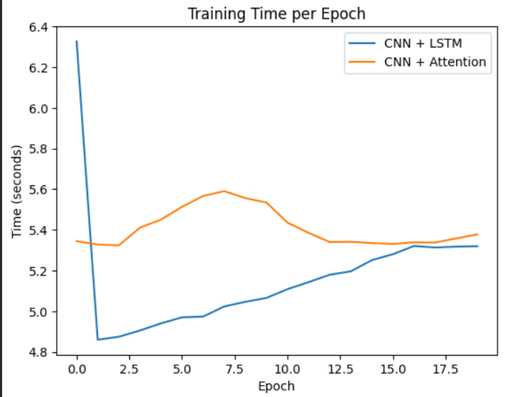
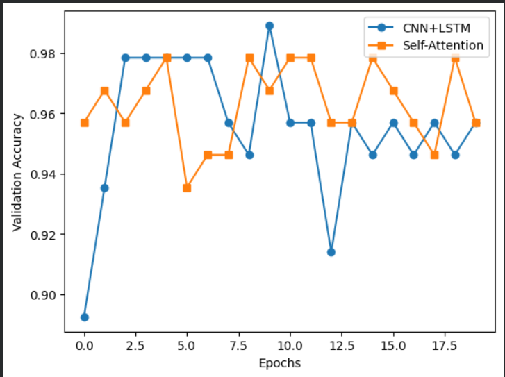
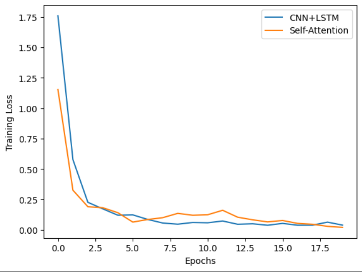

# 🎬 Video Action Recognition using CNN + LSTM and Self-Attention

This project implements a deep learning pipeline for **video action recognition** using PyTorch.  
Spatial features are extracted from frames using a **pretrained ResNet18 CNN**, and temporal relationships between frames are modeled using two approaches:

- **CNN + LSTM**
- **CNN + Self-Attention**

The goal of this project is to **compare temporal modeling techniques for video understanding**.

---

# 📌 Project Overview

Video action recognition requires learning:

• **Spatial information** → what appears in each frame  
• **Temporal information** → how actions evolve over time  

Two architectures were implemented and compared.

---

## CNN + LSTM Architecture

```
Video
  ↓
Frame Extraction
  ↓
CNN (ResNet18)
  ↓
Frame Feature Vectors
  ↓
LSTM (Temporal Modeling)
  ↓
Fully Connected Layer
  ↓
Action Prediction
```

---

## CNN + Self-Attention Architecture

```
Video
  ↓
Frame Extraction
  ↓
CNN (ResNet18)
  ↓
Frame Embeddings
  ↓
Temporal Self-Attention
  ↓
Mean Pooling
  ↓
Fully Connected Layer
  ↓
Action Prediction
```

---

# ⚙️ Key Features

• Implemented **end-to-end video action recognition pipeline**  
• Built **CNN + LSTM temporal architecture**  
• Built **CNN + Self-Attention model**  
• Compared models using:
  -Training Loss
  - Validation accuracy
  - Training time per epoch
• Implemented **video inference system for action prediction**
• Built **training/validation comparison visualizations**

---

# 📊 Dataset

For demonstration purposes, the model was trained on **10 action classes**:

```
IceDancing
SalsaSpin
BreastStroke
MilitaryParade
FloorGymnastics
BasketballDunk
UnevenBars
Kayaking
SkateBoarding
CuttingInKitchen
```

These classes were selected from a larger action recognition dataset UCF101.

---

# 📈 Model Comparison

## Validation Accuracy

| Model | Accuracy Range |
|------|---------------|
CNN + LSTM | ~94% – 99% |
CNN + Self-Attention | ~95% – 98% |

Observations:

• LSTM learns **faster in early epochs**  
• Self-Attention shows **more stable validation accuracy**

---

## Training Time per Epoch

| Model | Avg Time |
|------|----------|
CNN + LSTM | ~5.3 seconds |
CNN + Self-Attention | ~5.4 seconds |


Observations:

• Both models have **similar training time**
• Self-attention introduces **small overhead due to frame-to-frame interactions**

---

# 📊 Training Visualizations

The following comparisons were generated during experimentation:

```
1. Training Time vs Epoch
2. Validation Accuracy vs Epoch
```
<p align="center">
  
</p>

<p align="center">
  
</p>

<p align="center">
  
</p>

These visualizations help analyze:

• convergence speed  
• training stability  
• performance differences between architectures

---

# 📂 Project Structure

```
video-action-recognition/

models/
 ├── cnn_lstm.py
 ├── cnn_attention.py

utils/
 ├── dataset.py
 ├── frame_extraction.py

train.py
predict_video.py
inference.py

requirements.txt
README.md
```

---

# 🚀 How to Run

## Install Dependencies

```
pip install -r requirements.txt
```

---

## Train Model

```
python train.py
```

---

## Run Video Prediction

```
python predict_video.py
```

Example input:

```
Enter the video path: test_video.mp4
```

The model will process the video and output predicted actions.

---

# 🛠️ Technologies Used

```
PyTorch
Torchvision
OpenCV
NumPy
Matplotlib
Seaborn
```

---

# 📌 Future Improvements

Possible extensions of this project:

• Train on the **full action recognition dataset (100+ classes)**  
• Implement **CNN + Transformer Encoder** for full video transformers  
• Add **real-time webcam action recognition**  
• Implement **spatial attention visualization (Grad-CAM)**

---

# 📚 References

```
Attention Is All You Need — Vaswani et al.
PyTorch Documentation
Video Action Recognition research papers
```

---

# 👤 Author

```
Your Name
Deep Learning / Computer Vision
```
